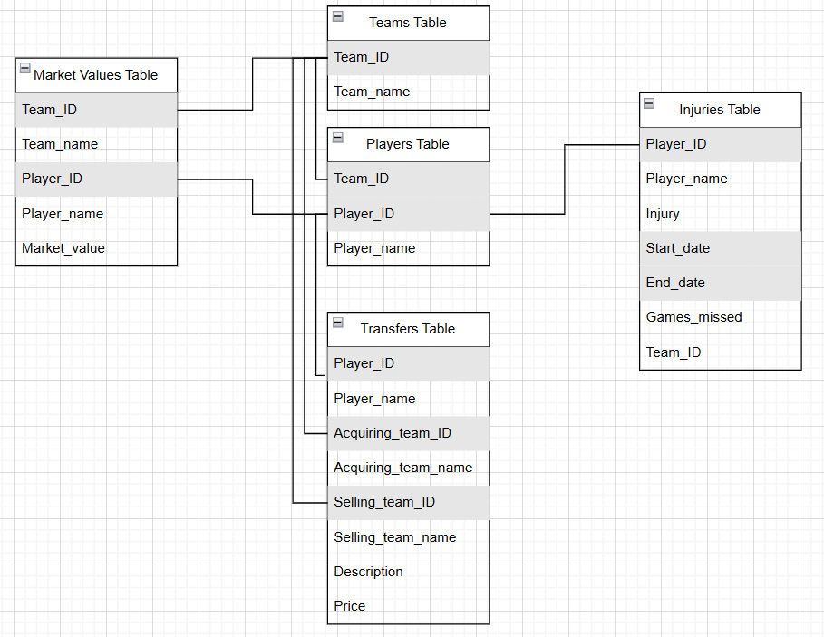

# Transfermarkt_DB_WSL

This project has been developed using the Windows Subsystem for Linux (WSL version 2.3.26.0).  
To run this project, make sure that Python 3.x is installed on your system 
and that MySQL is installed and running on the default port (3306).

This project implements a MySQL database comprising five tables, populated with data scraped from Transfermarkt.

The `execution_etl.sh` Bash script will:  
1. Set up the required virtual environment and install dependencies.  
2. Execute three Python scripts to:
   - Create a MySQL database with five tables.
   - Populate these tables with data scraped from Transfermarkt.  
   


## How to run 
### 0. Clone the repository
Run the following command from the terminal or command prompt: 
   ```bash
   git clone https://github.com/dieGeijo8/Transfermarkt_DB_WSL
   ```

### 1. Set System Variables  
   Open the file `execution_etl.sh` and define the system variables required to connect to MySQL:  
   - `host`: MySQL host (e.g., `localhost`).  
   - `username`: MySQL username.  
   - `password`: MySQL password.  
   - `database`: Name of the MySQL database to be created.  

### 2. Execute the Script  
   Run the following command from the terminal or command prompt:  
   ```bash
   bash execution_etl.sh
   ```
After the script completes, you may review the log file located at `ETL_scripts/execution.log`
. This file provides detailed information about the execution of the Python scripts.

## Verify Data in the Tables
To verify that data has been successfully inserted into all five tables, 
run the following command from the terminal:   
   ```bash
   source .venv/bin/activate
   python ExampleQueries_fromLocalURI.py
   ``` 
This script will print the first 10 rows from each table to the console.
